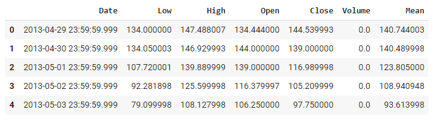
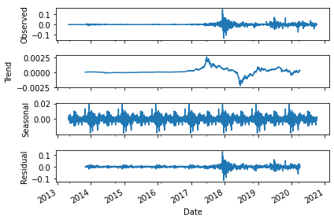
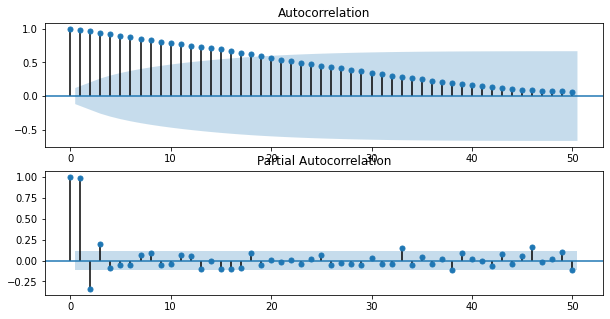
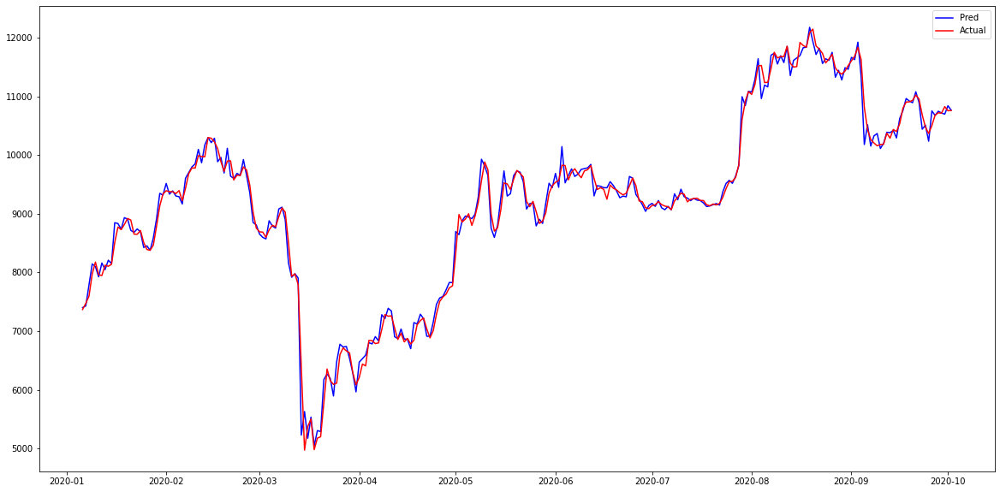

# BTC-Price-Prediction-ML-Project

## About
This project focuses on the prediction of the prices of Bitcoin, the most in-demand crypto-currency of today’s world. We predict the prices accurately by gathering data available at [coinmarketcap](https://web-api.coinmarketcap.com/v1/cryptocurrency/ohlcv/historical?convert=USD&slug=bitcoin&time_end=1601510400&time_start=1367107200) while taking various hyper-parameters into consideration which have affected the bitcoin prices until now. 

## Paper presentation
The [paper](9.pdf) contains all details of algorithms used along with results, anaylisis and discussions om the topic.

### Dataset
* [Dataset](https://web-api.coinmarketcap.com/v1/cryptocurrency/ohlcv/historical?convert=USD&slug=bitcoin&time_end=1601510400&time_start=1367107200) has been downloaded using coinmarketcap API.

* Dataset after Preprocessing

* Seasonal Decomposition of the Time-Series after order-1 differencing (to make it stationary)

* Correlation Plots 

* Best Results (GARCH + SARIMAX) (RMSE: 154.32)

### ML Models Used:
* Regression Models
  * Linear Regression with various penalties
  * Polynomial Regression
  * Bayesian Regression 
* ARIMA Models
  * AR
  * ARMA
  * ARIMA
  * SARIMAX
* SARIMAX + GARCH on the residuals of SARIMAX model
* VAR Model

### Python Dependencies:
* pandas
* numpy
* requests
* matplotlib
* statsmodels
* pmdarima
* arch

### Install Dependencies (requirements.txt)
1. pip install -r requirements.txt

OR

1. pipenv install --ignore
2. pipenv shell

### How to Run
1. cd \<PROJECT ROOT DIRECTORY\>
2. python \<filename\>.py

### File Descriptions:
* auto-ARIMA.py: Runs automated gridsearch from pmdarima library, to find the best model parameters.
* AR.py, ARMA.py, ARIMA.py, SARIMAX.py use the above found best parameters to train the respective models as per their filenames.
* GARCH-SARIMAX.py runs SARIMAX models added with error of residuals from SARIMAX using GARCH.
* elasticnet.py runs Linear Regression with a combination of L1 and L2 penalty.
* bayesian.py runs BayesianRidge regression with optimal parameters.
* polyreg.py runs Linear Regression by adding polynomial features.
* var.py runs runs VAR model on the data.

